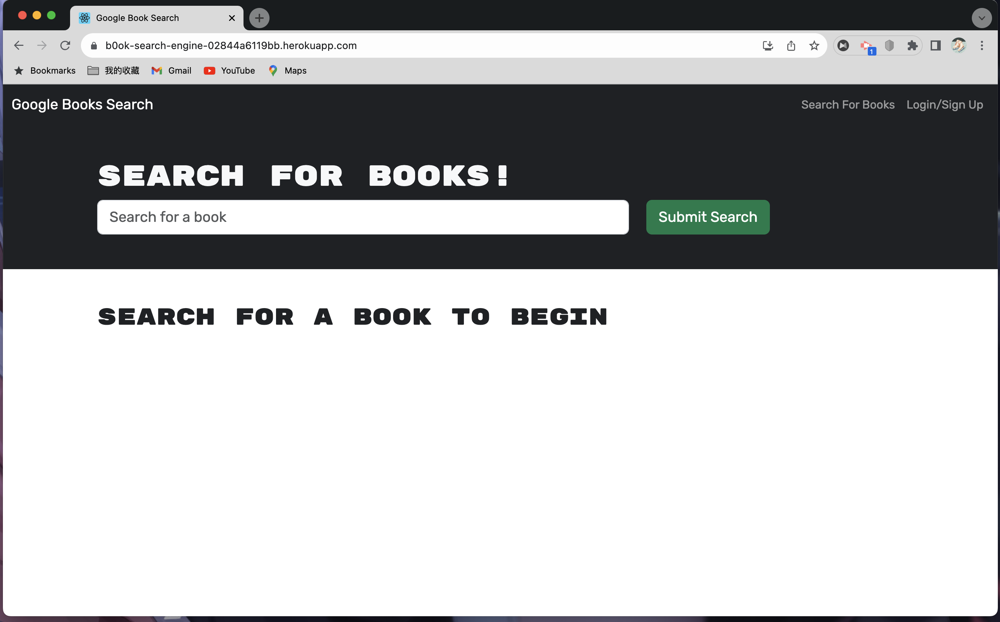
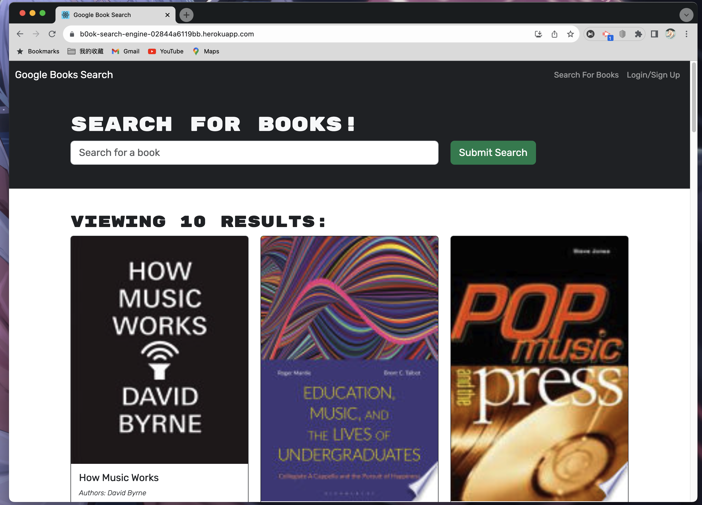
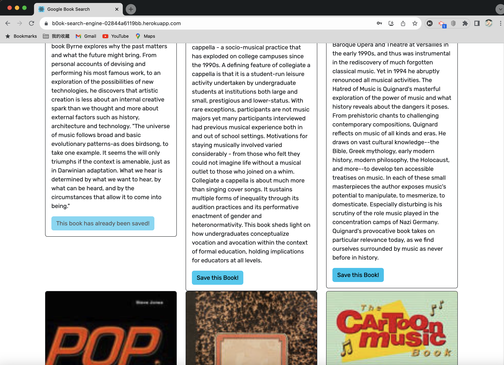
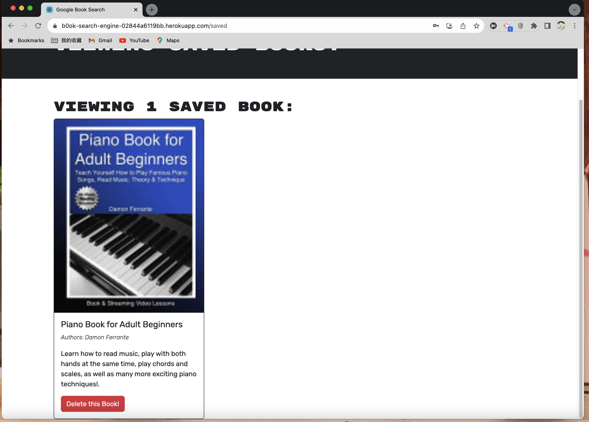

# Bo_ok-Search-Engine

## Description

A Book Search Engine website uses the Google Books API to fetch books. The application is built using GraphQL instead of a RESTful API.

## Table of Contents

- [Installation](#installation)
- [Usage](#usage)
- [Contributing](#contributing)
- [Tests](#tests)
- [License](#license)
- [Questions](#questions)
- [Deployed Application](#deployed-application)
- [Screenshots](#screenshots)

## Installation

`npm install`, `npm run build`, `npm run develop`

## Usage

1. Clone the repo.
2. Run npm install to install the dependencies.
3. Run `npm run build` to build the application.
4. Run `npm run develop` to start the application.
5. Open your browser and go to http://localhost:3001 to use the application.

## Contributing

OPEN-SOURCE

## Tests

N/A

## License

This project is licensed under the MIT license. Click the badge at the top of the README to learn more about the license terms and conditions.

## Questions

If you have any questions about this project, please contact me via:

- Email: yuhe.liang@outlook.com
- GitHub: https://github.com/Wallacethewonderer

## Deployed Application

https://b0ok-search-engine-02844a6119bb.herokuapp.com/

## Screenshots

